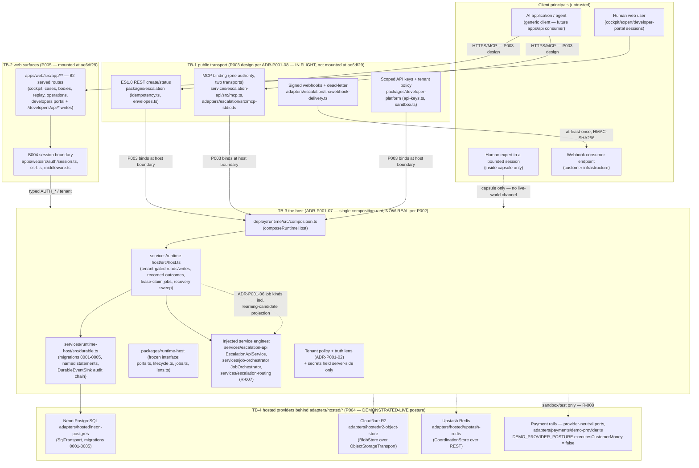

# P007 Threat Model — post-roadmap productionization (T1.0)

- **Work order:** P007 — Security, privacy and resilience (issue #159)
- **Dispatch:** 30-b — threat-model register, **read-only / docs-only scope** (wave 2, parallel
  with P003). The integrated P007 pass (tests/security/production/*,
  tests/resilience/production/*, docs/evidence/production/security/*) comes AFTER P006 and is
  NOT attempted here.
- **Modeled baseline:** main `ae6df29246528cd490a2cfad6f753960c4003283` (2026-10-09) — wave 1
  complete: P002 (PR #164), P004 (PR #162), P005 (PR #163) merged; P001 ADRs accepted.
- **Authority inputs:** `spec/post-roadmap-production-work-items.md` §P007;
  `docs/decisions/post-roadmap/ADR-P001-07.md` (host/provider trust boundary; fail-closed
  provider posture as an attack class); `docs/decisions/post-roadmap/ADR-P001-08.md`
  (auth/forgery/replay/idempotency-race attack classes); `docs/architecture-review/register.md`
  Part 5 (P007 required decisions: R-008 BLOCKED-COMMERCIAL in the threat model; learning
  rights/scope classes from the C022 boundary wall and lock rules 31/32);
  `spec/post-roadmap-release-gate.md` §3 (evidence-class vocabulary) and §4 (hard gates 1–2);
  `docs/LLM-ARCHITECT-FINAL-HANDOFF.md` §1 (limitation set L-01…L-11).
- **Companion document:** `findings-register.md` (severity vocabulary, disposition states, the
  initial honestly-dispositioned rows). No finding is closed by this model.

## 1. What this document is and is not

This is the P001-mandated threat model over the architecture **as actually built at the
modeled baseline** — every affected surface below names real files/modules that exist on main
at `ae6df29`. It is written BEFORE the integrated acceptance pass (P006) and the integrated
security pass (P007 full scope) so that those passes inherit a concrete, testable attack-class
list rather than improvising one (register Part 5; ADR-P001-08 consequences: "P007 inherits a
concrete attack-surface list").

It is NOT: a penetration-test report (no live attacks were run in this dispatch); a release
claim (release-gate §3: a reference-fabric test or build is never DEMONSTRATED-LIVE
evidence); a findings-closing instrument (the findings register keeps every row OPEN/BLOCKED);
or a design document for new surfaces (P003 owns transport; this model only describes what
P003's ADR-P001-08 design will expose).

Evidence-class labels used below reuse the release-gate §3 vocabulary exactly:
**DEMONSTRATED-LIVE**, **AUTOMATED-TEST-ONLY**, **OPEN**, **BLOCKED**, **WAIVED**. Where a
mitigation is only AUTOMATED-TEST-ONLY, the residual risk stays live until the integrated pass
proves it against the real host — that is the gap this model exists to track, not to paper
over.

## 2. The system as built — trust-boundary diagram

**Trust boundaries (the lines an attacker must cross):**

| # | Boundary | Where it physically lives at `ae6df29` | Status |
|---|---|---|---|
| TB-1 | Client → public transport (auth, scopes, idempotency, webhook signatures) | `packages/escalation`, `packages/developer-platform`, `adapters/escalation` contracts; listener mount is P003 (`apps/api`, `services/escalation-api/src/http-host/*`) | DESIGNED (ADR-P001-08) — not yet listening; attack surface is the contract set, adversarially tested in C001/C017 |
| TB-2 | Browser → web surfaces (session, CSRF, tenant) | `apps/web/src/auth/*` (B004), the 82-route tree mounted by P005 | NOW-REAL (mounted + tested; session store seam still defaults to in-memory fake — B005/B007 own the durable swap) |
| TB-3 | Host boundary (composition, persistence, jobs, secrets, tenant policy) | `deploy/runtime/src/composition.ts`, `services/runtime-host/src/host.ts` + `durable.ts`, frozen `packages/runtime-host` | NOW-REAL (P002 merged; five acceptance proofs on embedded Postgres + live Neon) |
| TB-4 | Host → hosted providers (fail-closed capacity, server-side secrets) | `adapters/hosted/{neon-postgres,r2-object-store,upstash-redis}` | NOW-REAL (P004 merged; failure/capacity matrices DEMONSTRATED-LIVE with redacted transcripts) |
| TB-5 | Expert session capsule (the EES1.0 wall) | `packages/expert-session/src/{capsule.ts,barrier.ts}`, `packages/expert-session-policy`, `adapters/expert-environment/src/materialize.ts` | Domain-model-enforced (C006 tests); NOT yet exercised through the durable host (P006's job) |
| TB-6 | Learning boundary (rights/scope wall) | `packages/capability-learning/src/{boundary.ts,gate.ts}`, `packages/learning`, lock rules 31/32 | Domain-model-enforced (C022 adversarial tests); host-side sinks wired via registered job kinds, integrated proof is P006/P007 |
| TB-7 | Commercial boundary (merchant-of-record/payout/tax/jurisdiction) | `adapters/payments/*`, `spec/post-roadmap-release-gate.md` §4 hard gate 1 | BLOCKED-COMMERCIAL (R-008) — release-owner decision, P008 |

**Provider posture law that shapes the whole model (ADR-P001-07):** the host owns every
platform concern; providers own only primitives behind `adapters/hosted/*`; secrets are read
from server-side env vars inside the adapters and never surface in typed errors (names only,
detail in `cause`); unconfigured adapters are DISABLED before any network call; there is no
alternate-route vocabulary anywhere in the ports, adapters or error taxonomy (no silent paid
fallback is even representable).

## 3. Assets and adversaries

**Assets at risk (A-…):**

- A-1 Tenant-scoped escalation records, lifecycle events, correlation chains (durable tables
  `arena_escalation_record` / `arena_escalation_event`, migrations 0003).
- A-2 Expert-session capsule contents: screened resources, time-limited credentials, expert
  work product (trajectories, artifacts, annotations — never chain-of-thought; lock rule 30).
- A-3 Developer API-key material (`dak_*` secrets; sha256-at-rest via `SecretHasher`) and the
  append-only key lifecycle.
- A-4 Webhook signing secrets and the at-least-once delivery/dead-letter trail.
- A-5 Payment/settlement state (sandbox/test lifecycle today; commercial posture R-008).
- A-6 Rights-cleared learning candidates, Q1.0 verdicts, gated improvement proposals
  (A021/A022/A023 destinations) — the global-knowledge commons.
- A-7 Evidence integrity: the tamper-evident audit chain (`DurableEventSink`,
  `verifyAuditChain`), content digests, append-only histories (lock rule 6).
- A-8 Capacity/budget posture: free-tier quotas, the fail-closed/no-paid-fallback law (FT2.0).
- A-9 The originating application's live world (external to Arena — must never be mutated).

**Adversaries (D-…):**

- D-1 Malicious or compromised client application (holds a legitimately issued scoped key).
- D-2 Authenticated but foreign-tenant caller (cross-tenant probing via any read/write path).
- D-3 Malicious or coerced expert attempting capsule escape or tool misuse.
- D-4 Network attacker (MITM on transport, webhook forgery, replay).
- D-5 Webhook consumer-side attacker (forged delivery, duplicate-processing races).
- D-6 Confused-deputy service bug (a service that accidentally skips a tenant/lens check —
  the bug class, not a person).
- D-7 Operator/insider with env-var access (secret leakage, capacity bypass attempts).
- D-8 Provider-side or compromise-of-provider scenario (Neon/R2/Upstash account takeover —
  cross-account reads; also the honest P004 scope note: single-account credentials could not
  test a true cross-account actor).
- D-9 Crash/power-loss itself (not an adversary, but the environment-level threat driving
  restart/partial-state and idempotency-race classes).

## 4. Attack classes

Organized per the work-items §P007 attack list, extended with the two register-Part-5 mandates
(R-008 commercial boundary inside class AC-09; learning rights/scope from the C022 boundary
wall + lock rules 31/32 in class AC-10). Each class carries: assets, vectors, REAL affected
surfaces, existing mitigations with their evidence class, and residual risk rated with the
severity vocabulary of §5 (also used by the findings register).

---

### AC-01 — Tenant isolation breaks

- **Assets:** A-1, A-2, A-6 (cross-tenant reads of escalations, sessions, learning
  candidates).
- **Vectors (D-1, D-2, D-6):** direct cross-tenant reads/writes by id; correlation-id listing
  across tenants; a service engine skipping the tenant gate; lens confusion (demo vs customer
  truth — ADR-P001-02); a future transport route forgetting the tenant policy the domain
  enforces (P003 wiring risk); replaying a foreign tenant's idempotency key (key scoped
  per-tenant by construction — `EscalationSubmissionIdentity` includes `tenantId`).
- **Affected surfaces:** `services/runtime-host/src/host.ts` (`escalationStatus` /
  `createEscalation` / advance paths, typed `RUNTIME_CROSS_TENANT_ACCESS`,
  `RUNTIME_ESCALATION_NOT_FOUND`, `ESCALATION_CROSS_TENANT_ACCESS`); the durable statements in
  `adapters/hosted/neon-postgres/src/runtime-statements.ts` + migration 0003
  (`create-runtime-escalation-records`); `packages/escalation/src/lifecycle.ts` (tenant
  checks); `apps/web/src/auth/session.ts` + mount-owned session probes
  (`apps/web/src/app/body-marketplace/_lib/session-probe.ts`); portal writes
  `apps/web/src/app/developers/_lib/portal-writes.ts` (tenant from the VALIDATED session,
  never the body; cross-tenant revoke denial is typed).
- **Existing mitigations:** P002 acceptance (e) — every cross-tenant path fails closed with
  typed errors on BOTH engines (embedded Postgres + live Neon) through the production
  composition: **DEMONSTRATED-LIVE** (deploy/runtime/EVIDENCE.md §e). P005 — fail-closed
  session probes, tenant/workspace mismatch fail-closed, cross-tenant revoke denial,
  tampered-cookie rejection: **AUTOMATED-TEST-ONLY** (portal-writes.test.ts,
  body-marketplace-mount.test.tsx). Demo-tenant read-only on portal writes (typed 403) keeps
  demo/customer truth separate.
- **Residual risk:** the transport boundary (TB-1) does not exist yet, so end-to-end tenant
  policy through real HTTP is unproven (P003/P006); correlation listing returns 0 rows
  cross-tenant but the read-model services behind many web routes still run on in-memory
  fabrics (session store default is the fake — the SEAM is durable-swap territory). Concurrent
  cross-tenant write races untested until P006. **Severity: HIGH residual** (release-gate §4
  hard gate 2 — any integrated-pass break here blocks release). Register rows: F-01 (fabric
  seams), F-03 (single-run live scope).

---

### AC-02 — Capsule secrets and expiry

- **Assets:** A-2 (capsule contents, time-limited credentials), A-1 (the escalation the
  capsule is scoped to).
- **Vectors (D-3, D-2, D-6):** using a capsule after `expiresAt` (expiry bypass); barrier
  credentials outliving the capsule; re-scoping a capsule to another escalation/tenant; secret
  material entering the capsule unscreened; a materialization step
  (`adapters/expert-environment/src/materialize.ts`) that leaks host-authority credentials into
  the replica.
- **Affected surfaces:** `packages/expert-session/src/capsule.ts` (mandatory `expiresAt > createdAt`;
  barrier credential expiry must not outlive capsule expiry; capsule bound to exactly one
  escalation id + tenant; content-addressed sha256; deep-frozen; typed authority marker
  `'non-authoritative-replica'`), `packages/expert-session/src/barrier.ts` (the EES1.0 control
  set: field/document redaction, tool exclusion, tenant boundary, identity masking,
  time-limited credentials, read-only resources, action allowlist, download/clipboard/
  screenshot restrictions; FAIL-CLOSED composition), `packages/expert-session-policy/src/{retention.ts,tenancy.ts,controls.ts,pack.ts}`,
  `services/expert-session/src/service.ts`.
- **Existing mitigations:** C006 adversarial suites (`capsule.test.ts`,
  `modes-barrier.test.ts`, policy `tenancy.test.ts`/`retention.test.ts`):
  **AUTOMATED-TEST-ONLY**. The durable host does not yet persist or serve session capsules
  (P002's durable scope was escalation/job/idempotency/projection records), so no live
  capsule path exists to attack yet — which is precisely why this stays residual.
- **Residual risk:** all capsule enforcement is object-model-level; the integrated pass must
  prove expiry/secrets survive real materialization + restart (a capsule whose lease state is
  only process-local could resurrect after restart if not derived deterministically from the
  persisted record). **Severity: MEDIUM now, HIGH at the integrated pass** (privacy class;
  hard-gate adjacent). Register rows: F-01, F-03.

---

### AC-03 — Unauthorized tool/action use

- **Assets:** A-2, A-9 (actions the expert can take inside the capsule; tools reachable).
- **Vectors (D-3, D-6):** an empty-but-truthy allowlist admitting everything (the inverse of
  the law); mode confusion (a TEACH-mode escalation admitting SOLVE-mode actions); a
  tool-gap/knowledge submission path that executes instead of records; escape into the host
  application's live environment; export-channel misuse (download/clipboard/screenshot).
- **Affected surfaces:** `packages/expert-session/src/barrier.ts` (`PRIVACY_CONTROL_KINDS`,
  mandatory action allowlist — empty admits nothing; `assertNoEscape` → typed
  `ESCAPE_ATTEMPT`; `EXPORT_CHANNELS` restrictions default ON), `packages/expert-session/src/modes.ts`
  + `modes-barrier.test.ts` (mode-allowed action sets), `packages/expert-session/src/{toolgap.ts,knowledge.ts,submission.ts}`,
  `packages/intervention/src/modes.ts` (intervention modes), `packages/environment-runtime/src/{admission.ts,isolation-envelope.ts}`
  (workload admission + isolation), `services/environment-runner/src`.
- **Existing mitigations:** C006/C007/C009 adversarial tests (escape attempts, mode/action
  mismatch, unauthorized tool submission): **AUTOMATED-TEST-ONLY**.
- **Residual risk:** enforcement is domain-model-level; the real environment runner
  composition (which tools exist at runtime, how the allowlist maps to actual tool calls) is
  exercised only through reference fabrics until P006. **Severity: MEDIUM now, HIGH at the
  integrated pass.** Register rows: F-01, F-03.

---

### AC-04 — Webhook forgery and replay

- **Assets:** A-4, A-1, consumer-side state (D-5's target).
- **Vectors (D-4, D-5):** forged signature without the secret; replaying a captured delivery
  to double-act on the consumer; per-TYPE dedupe wrongly suppressing a legitimately distinct
  event (the R-032 error class — `escalation.progressed` legitimately recurs across
  transitions); timing attack on signature comparison; stale-signature replay (an old but
  valid signature re-sent later); dropping deliveries to hide evidence (dead-letter abuse).
- **Affected surfaces:** `adapters/escalation/src/webhook-delivery.ts` — HMAC-SHA256 over
  `<timestamp>.<payload>`, header `x-arena-signature: v1=<hex>`, `timingSafeEqual` comparison,
  `verifyWebhookSignature` with default 300 000 ms timestamp tolerance
  (`timestamp-mismatch` rejection; malformed-header and signature-mismatch rejections),
  `x-arena-event-id` as THE dedupe key (per EVENT ID, never per type — ADR-P001-08 decision 4),
  deterministic exponential backoff, explicit auditable dead-letter after `maxAttempts`, never
  a silent drop; the outbox drained through a structural port (`WebhookOutboxSource`),
  `services/escalation-api/src/service.ts` (outbox maintenance), the closed 13-type taxonomy in
  `packages/escalation/src/events.ts`.
- **Existing mitigations:** C001/C019 adversarial suites (`webhook-delivery.test.ts` —
  forgery, tampering, retry, dead-letter, dedupe-by-event-id):
  **AUTOMATED-TEST-ONLY**. No listener is mounted yet (P003 owns
  `services/webhook-delivery/*`), so no live webhook has been delivered by the platform.
- **Residual risk:** live signing-secret custody and rotation story at the listener is P003
  scope; consumer-side replay tolerance defaults exist but consumer education/verification
  library distribution is an OPEN posture; redelivery-after-restart must be proven durable
  (outbox persistence through the host is P002-wired but the delivery loop itself is P003).
  **Severity: HIGH residual** at the integrated pass (forgery of a money-adjacent lifecycle
  event is a trust-destroying class); MEDIUM until a listener exists. Register rows: F-01,
  F-03.

---

### AC-05 — API-key leakage

- **Assets:** A-3 (and through it, A-1 as the escalation surface the key authorizes).
- **Vectors (D-1, D-7, D-4, D-6):** secret echoed in logs/trajectories/wire forms; retrieval
  of a stored secret after issuance; a key minting another key (privilege escalation via
  `keys:manage`-style scope); scope escalation (sandbox key creating escalations); key
  surviving revocation/rotation; secret extraction from error messages or evidence
  transcripts; cross-tenant key use.
- **Affected surfaces:** `packages/developer-platform/src/api-keys.ts` (secret shown ONCE at
  issuance/rotation; stored ONLY as sha256 hash via `SecretHasher`; NO `keys:manage` scope —
  "a key can never mint another key"; append-only `active → rotated | revoked` lifecycle,
  history retained, records never deleted; rotation mints successor with `rotatedFrom` chain;
  revocation terminal), `packages/developer-platform/src/shared.ts`
  (`newDeveloperKeySecret` — `dak_<environment>_<64 hex>`), `packages/developer-platform/src/sandbox.ts`
  (sandbox scope allowlist DENIES `escalations:create`; sandbox/live environment separation),
  `apps/web/src/app/developers/api/**` (five POST routes; secret shown exactly once in the
  response, never retrievable again), `apps/web/src/app/developers/_lib/portal-writes.ts`
  (authorize-before-validate; tampered-secret fail-closed; typed envelopes with no secret
  material).
- **Existing mitigations:** C017 adversarial suites + P005's `portal-writes.test.ts`
  (15 tests: closed-scope rejection — a key can never mint a key; cross-tenant revoke denial;
  tampered-secret fail-closed; register→issue→run→rotate→revoke lifecycle over the REAL
  developer-platform service): **AUTOMATED-TEST-ONLY**. P004's live transcripts demonstrate the
  adapter-side analogue discipline (env-var NAMES in typed messages, values only as `cause`,
  canary-tested) — the same hygiene class: **DEMONSTRATED-LIVE** (for provider secrets, at the
  adapter boundary).
- **Residual risk:** the developer-platform service backing the portal is still the
  process-singleton in-memory reference fabric (P005 §6.4 — durable swap is a disclosed
  follow-up), so key records/revocation do not survive restart today; the console UI is not
  yet wired to the S-03 endpoints (F-05) so no human-facing key flow exists yet; transport-
  level key handling (header parsing, timing-safe comparison at the listener) is P003 scope.
  **Severity: MEDIUM residual** (secret-at-rest hygiene is strong; durability + transport are
  the gaps). Register rows: F-01, F-05.

---

### AC-06 — Object-store cross-tenant access

- **Assets:** A-2 (artifacts in the object store), A-7 (digest-addressed evidence).
- **Vectors (D-2, D-8, D-6):** guessing/enumerating another tenant's object key; using valid
  credentials against a foreign bucket; unsigned/anonymous object access; a domain layer
  handing out a digest-addressed object without re-checking tenant ownership (the store
  itself is tenant-blind — keys are content digests, tenancy lives in the domain); bucket
  shared across tenants becoming a side channel (object existence oracle via PUT collision).
- **Affected surfaces:** `adapters/hosted/r2-object-store/src/{adapter.ts,object-storage-transport.ts}`
  (BlobStore: probe/head/get/put/delete over the AWS SDK pinned transport), object keys are
  content digests (`sha256:…`), `deploy/src/hosted/quotas.ts` + `fail-closed.ts` (capacity
  gates), the domain layers that gate object issuance (artifact/intervention services).
- **Existing mitigations (P004, all committed as redacted live transcripts —
  docs/evidence/production/providers/r2/failure-capacity-matrix.md):** wrong secret → typed
  `PERSISTENCE_TRANSPORT_FAILED`, probe DEGRADED (never AVAILABLE): **DEMONSTRATED-LIVE**;
  foreign/unauthorized bucket → 404 `NoSuchBucket` typed error, no fallback:
  **DEMONSTRATED-LIVE** (honest scope: single-account credentials — a TRUE cross-account
  bucket in another Cloudflare account is unreachable from these credentials; the
  nonexistent-bucket name is the client-side shape of that attempt); anonymous unsigned GET of
  a LIVE object → HTTP 400 `InvalidArgument "Authorization"` — private-by-default:
  **DEMONSTRATED-LIVE**; wrong-secret read of an existing object → 403 before object-level
  authorization (existence/bytes not disclosed): **DEMONSTRATED-LIVE**.
- **Residual risk:** cross-ACCOUNT access is honestly not claimable (F-04d) — an attacker who
  compromises provider credentials has the whole bucket regardless of Arena's domain checks;
  content-digest keys make enumeration a preimage problem but object existence is still an
  oracle; live quota exhaustion not demonstrated (F-04a); R2 retention/lifecycle operations do
  not exist in the port (deletion is immediate — F-04b), so retention-policy enforcement is
  out of reach of the adapter today. **Severity: MEDIUM residual.** Register rows: F-04a,
  F-04b, F-04d.

---

### AC-07 — Idempotency races

- **Assets:** A-1 (submission identity), A-5 (double-charging/double-acting risk), A-7.
- **Vectors (D-1, D-9):** two concurrent submissions of the same identity (tenant, key,
  correlation) racing the record insert; the same key with a different body (rebinding — must
  stay the typed `ESCALATION_IDENTITY_CONFLICT`, never a silent overwrite); retry storms
  racing recorded-outcome lookup; a restart landing between accept and record; the portal
  writes' process-local memo losing a replay across processes/instances.
- **Affected surfaces:** `packages/escalation/src/idempotency.ts` (the tri-state verdict
  `created | replay | conflict`; identity triple includes tenant; digest comparison),
  `services/runtime-host/src/host.ts` (recorded-outcome host surface; retries return the
  RECORDED outcome — deterministic replay), `adapters/hosted/neon-postgres/src/runtime-statements.ts`
  + migration 0005 (`create-runtime-idempotency-and-projections`;
  `insert_escalation_record` gained `RETURNING request_id` because a plain `ON CONFLICT DO
  NOTHING` insert returns zero rows — the only success signal), `adapters/hosted/upstash-redis`
  (CoordinationStore idempotency sub-surface — one of the four bounded sub-surfaces:
  cache/idempotency/rate-limit/lease), `apps/web/src/app/developers/_lib/portal-writes.ts`
  (per-tenant+action idempotency key REQUIRED; replay/conflict typed — but memo is
  process-local).
- **Existing mitigations:** P002 acceptance (d) — re-submission returned `outcome="replay"`
  with the same `requestId` and byte-stable recorded outcome (274 bytes) in
  `arena_runtime_idempotency`: **DEMONSTRATED-LIVE** (single-run class). P004 — Upstash
  coordination semantics (the actual idempotency operation, not PING):
  **DEMONSTRATED-LIVE**. P005 portal idempotency semantics: **AUTOMATED-TEST-ONLY**
  (process-local memo — disclosed).
- **Residual risk:** CONCURRENT same-identity races are explicitly disclosed as P006/P007
  scope (P002 EVIDENCE.md: "Live evidence is a single-run class per branch… Concurrency races
  and provider-outage windows belong to P006/P007") — the sequential replay proof does not
  prove the racing-insert path; the portal memo is process-local (F-01). **Severity: HIGH at
  the integrated pass** (money-adjacent double-act class); MEDIUM now. Register rows: F-01,
  F-03.

---

### AC-08 — Worker restart and partial state

- **Assets:** A-1, A-5, A-7 (accepted work, job progress, audit chain integrity).
- **Vectors (D-9):** hard kill between two statements (partial write); a claimed job orphaned
  by process death (lease never released — work stuck); duplicate transition emission after
  restart; migration applied halfway (see AC-11/F-02 interaction); the audit chain breaking
  across the restart boundary; a partially-started host serving traffic.
- **Affected surfaces:** `services/runtime-host/src/host.ts` (`start()` order: fail-closed
  transport check → migrations → audit-tail hydration → recovery sweep; `failed` is terminal —
  never a partially-started host; `stop()` idempotent), the recovery sweep
  (`nonTerminalJobs`/`reclaimedLeases`/`terminalJobsUntouched` — expired-lease reclaim at
  start), lease claiming (`claimWithLease`, default 60 s, host instance identity recorded),
  dead-letter lot for terminally-failed jobs, `services/job-orchestrator` (the ONE shared
  durable runner — ADR-P001-01), append-only stores + `verifyAuditChain`.
- **Existing mitigations:** P002 acceptance (c) — claimed-then-orphaned job reclaimed by the
  next start; event history preserved verbatim (canonical comparison — jsonb reorders keys);
  history length and state UNCHANGED across the boundary; audit chain digest-linked across
  the boundary; proven on BOTH engines: **DEMONSTRATED-LIVE** (single-run class). Zero-
  credential fail-closed boot (P004 capacity evidence): **DEMONSTRATED-LIVE**.
- **Residual risk:** the Neon HTTP SQL proxy's one-command-per-prepared-statement constraint
  forces sequential, non-transactional multi-command DDL application (F-02) — a mid-sequence
  crash leaves a partially-applied migration that only re-runs cleanly because the DDL is
  idempotent-by-contract and the ledger records a version only after full application
  (disclosed, not papered over); single-run evidence is not a soak (F-03); multi-instance
  host operation (two hosts racing leases on one store) is untested. **Severity: MEDIUM
  residual.** Register rows: F-02, F-03.

---

### AC-09 — Partial payment state + the BLOCKED-COMMERCIAL boundary (R-008)

- **Assets:** A-5 (payment/settlement state), customer money (NOT held today — by posture),
  legal/tax standing of the operator.
- **Vectors (D-1, D-6):** a settlement stuck between charge and record (double-act or
  lost-act on retry); sandbox state presented as customer-truth; the boundary itself being
  bypassed — enabling live-money movement before merchant-of-record/payout/tax/refund/
  dispute/jurisdiction responsibility is settled in writing (the R-008 BLOCKED-COMMERCIAL
  attack class: not a code exploit but a governance bypass whose harm is unlawful money
  movement).
- **Affected surfaces:** `adapters/payments/src/demo-provider.ts`
  (`DEMO_PROVIDER_POSTURE.executesCustomerMoney = false` — the recorded commercial truth),
  provider-neutral payment ports (lock rule: payment is provider-neutral in domain contracts;
  no live-money claim without approved production/compliance ownership), payment lifecycle in
  the C010 services, the release gate itself (`spec/post-roadmap-release-gate.md` §4 hard
  gate 1: "no live-money activation or claim until the real payment provider,
  merchant-of-record, payouts, tax, refunds/disputes and jurisdiction responsibilities are
  settled in writing. Deterministic payment abstractions and sandbox flows do not satisfy
  this gate").
- **Existing mitigations:** the posture is recorded in code and evidence
  (`PROVIDER_POSTURE_OPEN_QUESTIONS` / `DEMO_PROVIDER_POSTURE`, register row R-008 —
  BLOCKED-COMMERCIAL, deferred to the release owner under the P008 hard gate; **no
  customer-truth payment label may be issued before it**): **BLOCKED** disposition (this is
  the mandated threat-model appearance of R-008 — register Part 5). Payment tests are
  deterministic/sandbox: **AUTOMATED-TEST-ONLY**.
- **Residual risk:** the commercial boundary holds BY CONSTRUCTION today (no live rail
  exists); the residual is procedural — any future live-rail wiring must pass the hard gate
  first, and partial-state settlement races (charge-succeeded/record-failed) must be attacked
  in the integrated pass with the sandbox rail. **Severity: CRITICAL-if-bypassed;
  currently BLOCKED-COMMERCIAL (not exploitable while no live rail exists).** Register row:
  F-07.

---

### AC-10 — Learning rights/scope (C022 boundary wall; lock rules 31/32)

- **Assets:** A-6 (the global-knowledge commons), A-2 (consent-gated task-specific advice),
  A-7 (historical trajectories/evidence — must never be rewritten).
- **Vectors (D-1, D-6):** silent promotion of task-specific advice to global knowledge
  (rights-free learning — THE work-items named class); an ungated improvement proposal
  reaching an A021/A022/A023 destination; learning rewriting historical trajectories/task
  versions/certification evidence (LE1.0 violation); a proposal whose "new" artifact is
  actually a consumed historical digest (rewrite-by-collision); evaluator-change masquerading
  as capability lift; adopting on an unmeasured protected capability; cross-tenant learning
  without explicit consent.
- **Affected surfaces:** `packages/capability-learning/src/boundary.ts` (the three-layer
  LE1.0 wall: read-only deep-frozen candidates; new content-addressed outputs; rewrite
  detection — `CAPABILITY_LEARNING_BOUNDARY_VIOLATION` on proposing any consumed historical
  digest), `packages/capability-learning/src/gate.ts` (Q1.0 five-condition adoption gate:
  pinned evaluation population, verification audit survived, evaluator/version changes
  accounted for, protected-capability regression measured, uncertainty reported — typed closed
  verdicts; evaluator confounds structurally refused), `packages/capability-learning/src/{proposal.ts,program.ts,compiler.ts}`
  (gated `GatedImprovementProposal` envelopes — full lineage, ADR-P001-03),
  `packages/learning/src/boundary.ts` + `packages/learning/src/verdict.ts`
  (`decideCapabilityLift` — 'lift-demonstrated' vs 'inconclusive-unless-controlled'),
  `services/security/src/service.ts` (`authorizeCrossTenantLearning` — explicit-consent gate,
  audited), host-side projection job kinds (`packages/runtime-host/src/jobs.ts` —
  `learning-candidate-projection` is a REGISTERED durable job kind: ADR-P001-06), lock rules
  31/32 (an accepted escalation result is operationally distinct from any reusable learning
  artifact; interventions may produce improvement candidates without silently mutating the
  host application's live agent).
- **Existing mitigations:** C022 adversarial suites (boundary wall, gate verdicts, ungated-
  proposal impossibility — "structurally impossible", ADR-P001-03 consequences):
  **AUTOMATED-TEST-ONLY**. The host-side sinks are registered job kinds; the integrated
  consent/rights-gated loop proof (P006's acceptance: "consent/rights-gated learning
  candidate and Q1.0") is pending.
- **Residual risk:** the wall is domain-model-enforced but the end-to-end path (capsule →
  candidate → projector → proposal → destination adoption) through the DURABLE host has never
  run live; a projector/sink wiring bug (the C022-disclosed "mirror types, pending adapter
  wiring" class that ADR-P001-03 resolved by decision) is exactly where a silent promotion
  could hide. **Severity: HIGH at the integrated pass** (rights/privacy class; hard-gate
  adjacent — "no rights-free global learning occurs" is a P006 acceptance line). Register
  rows: F-01, F-03.

---

### AC-11 — Digest mismatch

- **Assets:** A-7 (evidence/digest integrity), A-6 (content-addressed learning artifacts),
  A-2 (capsule identity).
- **Vectors (D-1, D-6, D-9):** canonicalization drift between two digest producers (the SAME
  bytes digesting differently, or different bytes colliding by serialization quirk — the
  jsonb key-reordering class P002 actually HIT and had to canonical-compare around);
  digest-computation reimplementation (each package must use
  `@arena/protocol-core`'s `digestCanonical`/`digestBinary`, never roll its own); a
  schema/contract drift making two versions of "the same" record digest differently;
  upgrade-path digest instability (migrations rewriting history).
- **Affected surfaces:** `packages/protocol-core/src/{digest.ts,canonical-json.ts}` (the ONE
  digest/canonicalization authority), per-package `drift.test.ts` + `contracts.parity.test.ts`
  (drift guards across packages — escalation, learning, capability-graph, environment-
  protocol, trajectory, capability-case, runtime-host hygiene), `packages/expert-session/src/capsule.ts`
  (sha256 over canonical JSON of the digest-free view via protocol-core),
  `packages/capability-learning/src/boundary.ts` (digest collision = rewrite detection),
  `services/runtime-host/src/durable.ts` (the DurableEventSink audit cache) +
  `packages/job-protocol` (`verifyAuditChain`),
  `adapters/hosted/neon-postgres/src/sql-transport.ts` (the command-splitter — quote/comment/
  dollar-quote aware — which must not alter statement semantics).
- **Existing mitigations:** P002's canonical-comparison discipline (the live battery FOUND
  jsonb key reordering and the comparison was made canonical — the exact digest-mismatch
  class, handled honestly): **DEMONSTRATED-LIVE** (in evidence). Drift/parity suites across
  packages: **AUTOMATED-TEST-ONLY**.
- **Residual risk:** cross-ENGINE digest stability (Neon HTTP vs embedded PGlite vs
  Upstash-serialized values) beyond the two engines proven; versioned envelope bumps
  (`GATED_PROPOSAL_VERSION` etc.) must never silently change digest inputs — guarded by drift
  tests but only tested, not live-proven. **Severity: LOW-MEDIUM residual.** Register rows:
  F-03 (single-run scope).

---

### AC-12 — Policy drift

- **Assets:** A-8 (quota/capacity posture), A-2 (barrier/policy bundles applied to capsules),
  the security policy registry (A-1 adjacent).
- **Vectors (D-7, D-6):** the deployed configuration drifting from the normative document
  (quota ceilings vs `docs/deployment/free-tier-architecture.md`); a policy bundle that
  silently loses a control between pack/unpack (`packages/expert-session-policy/src/pack.ts`);
  a mode policy sink not receiving the composed policy (R-041 — sinks injected at the host
  composition); env-var configuration drift between deploy environments (missing/short
  `ARENA_SESSION_SECRET` must stay the typed `AUTH_DISABLED`, never a weak default);
  capacity-reported-healthy-when-misconfigured (the inverse-failure class).
- **Affected surfaces:** `deploy/src/hosted/quotas.ts` (ceilings pinned by
  `quotas.test.ts` against the normative doc — "any drift from the architecture document
  fails the deploy battery"), `deploy/src/hosted/fail-closed.ts`, `packages/expert-session-policy/src/{pack.ts,resolution.ts,controls.ts}`,
  `packages/expert-session/src/barrier.ts` (policy travels WITH the capsule),
  `apps/web/src/auth/session.ts` (`createEnvSessionBoundary` — missing/short secret throws
  typed `AUTH_DISABLED`; no weak default key), `services/security/src/registry.ts` +
  `service.ts` (content-addressed policy bundles, conflict-typed registration, audited
  authorization decisions), adapter `capacityProbe()` posture (a misconfigured adapter is
  NEVER reported healthy — DEGRADED with structured reasons, P004-live-proven).
- **Existing mitigations:** deploy quota pinning test: **AUTOMATED-TEST-ONLY**; P004
  capacity-state discipline (wrong credentials → DEGRADED, never AVAILABLE):
  **DEMONSTRATED-LIVE** (r2 + upstash failure matrices); security-service audited policy
  decisions: **AUTOMATED-TEST-ONLY**.
- **Residual risk:** policy drift ACROSS the future transport boundary (P003 must enforce
  the same tenant/scope policy the domain enforces — a listener that under-enforces would be
  a drift hole); usage metering for quota ceilings is still unbuilt (`used`/`remaining` stay
  `null` until a meter exists — B019's disclosed gap), so capacity visibility is partial.
  **Severity: MEDIUM residual.** Register rows: F-04a (metering gap), F-03.

---

### AC-13 — Live-world writeback

- **Assets:** A-9 (the originating application's authoritative live world — Arena's
  most-fundamental external trust promise).
- **Vectors (D-1, D-3, D-6):** an expert action reaching the host application's live
  environment (capsule escape — overlaps AC-03); a replay that mutates instead of observes
  ("Replay is observational unless a separately authorized action is explicitly issued");
  a writeback channel smuggled into an envelope/adapter; the integrated client (Epoch or
  generic) being talked into executing a proposed mutation without its own authorization.
- **Affected surfaces:** `packages/expert-session/src/capsule.ts` (`CAPSULE_AUTHORITY =
  'non-authoritative-replica'`; "NO live-world write channel exists in the object model"),
  `packages/expert-session/src/barrier.ts` (the ESCAPE LAW — `assertNoEscape` → typed
  `ESCAPE_ATTEMPT` for live-world or cross-tenant resource/tool reach),
  `packages/expert-session/src/replay.ts` (observational replay semantics),
  `packages/intervention/src/{trajectory-binding.ts,results.ts}` (results are typed
  proposals/observations, not executions), `packages/replay-ui/src/truth.ts`, the
  host-mediated cross-domain execution law (R-009/R-070: observed events become authorized
  commands, never direct cross-service writes).
- **Existing mitigations:** C006/C007 adversarial suites (escape attempts, observational
  replay, negative tests in `services/intervention/src/negative.test.ts`):
  **AUTOMATED-TEST-ONLY**. P006's acceptance will add "observational replay with external
  live-world writeback denied" as an integrated proof — pending.
- **Residual risk:** the domain model has no write channel to remove — the attackable surface
  is the WIRING (any future adapter/host code that constructs a live credential or a real
  write API call from capsule-adjacent data). **Severity: HIGH at the integrated pass**
  (foundational trust class); by-construction-blocked in the object model today. Register
  rows: F-01, F-03.

---

### AC-14 — Fail-closed bypass (provider posture as an attack class — ADR-P001-07)

- **Assets:** A-8 (budget/capacity posture), A-1/A-2 availability, the platform's cost
  integrity; indirectly every tenant's data (a bypass that routes to a parallel unauthorized
  store).
- **Vectors (D-7, D-6, D-1):** persuading/patching the system to route around a DISABLED or
  EXHAUSTED provider to an alternate destination (the "silent paid fallback" — FT2.0's named
  evil); making a misconfigured adapter report healthy (availability spoofing — the inverse
  failure); swallowing the typed capacity error and proceeding anyway (a caller-side
  catch-and-continue); quota exhaustion being invisible (no meter) so exhaustion is never
  declared while spend continues; a weak-default configuration path (e.g., a default
  connection string or default key) that silently enables a provider.
- **Affected surfaces:** `adapters/hosted/*/src/{adapter.ts,env.ts}` (unconfigured → DISABLED
  before any network call → typed `PERSISTENCE_CAPACITY_DISABLED`; capacity states
  AVAILABLE/DEGRADED/EXHAUSTED/DISABLED with structured reasons; no alternate-route
  vocabulary anywhere in ports/adapters/error taxonomy), `packages/persistence` (the
  provider-neutral ports; `assertCapacityUsable`; `CAPACITY_EXHAUSTION_POLICY ===
  'fail-closed'` is the ONLY representable policy), `deploy/src/hosted/{quotas.ts,fail-closed.ts}`,
  `services/runtime-host/src/host.ts` (`start()` fails closed BEFORE anything else when no
  usable transport — state `failed`, never partially started), `apps/web/src/auth/session.ts`
  (the auth-side analogue: missing secret → typed `AUTH_DISABLED`, no weak default).
- **Existing mitigations (P004, redacted live transcripts):** zero-credential boot —
  DISABLED before any transport exists, complete env-var-name lists embedded:
  **DEMONSTRATED-LIVE** (capacity/zero-credential-boot.md); wrong credentials → typed
  transport failure + DEGRADED probe (never AVAILABLE): **DEMONSTRATED-LIVE** (both R2 and
  Upstash matrices); port-level exhaustion gate + 429 path + single-attempt adapter posture:
  **AUTOMATED-TEST-ONLY** (a live quota trigger is honestly NOT claimed — F-04a); P002's
  fail-closed start: **DEMONSTRATED-LIVE** (composition-parity suite).
- **Residual risk:** the metering gap (EXHAUSTED can only be DECLARED, not measured, until
  the usage meter exists — adapters never fabricate an EXHAUSTED reading, which is honest but
  leaves the gate partially blind); catch-and-continue at CALLER sites is a code-review/
  integrated-test concern (no static law can stop a caller swallowing a typed error);
  multi-instance capacity semantics untested. **Severity: MEDIUM residual.** Register rows:
  F-04a, F-03.

---

## 5. Severity vocabulary (shared with findings-register.md)

Defined per the P007 acceptance language ("critical/high findings fixed or explicitly block
release; regression tests reproduce findings; lower-severity findings have
owners/dispositions"):

| Severity | Definition (a finding is this when…) | Gate consequence |
|---|---|---|
| **critical** | A confirmed bypass of tenant isolation, capsule privacy, learning rights, evidence integrity, live-world boundary or the commercial boundary that is reachable in the integrated path and requires no privileged preconditions; OR any live-money movement outside the R-008 gate. | Blocks release until fixed (fix + regression test) or formally accepted in writing by the release owner with recorded rationale. |
| **high** | A confirmed bypass needing non-default preconditions, a narrower blast radius (single tenant, single record class), or a money/integrity double-act class (idempotency race, webhook forgery) proven reachable in the integrated path; OR a disclosed structural gap that leaves one of the above unproven at gate time. | Blocks release until fixed or formally accepted with rationale; must carry owner + next step. |
| **medium** | Degradation or partial-scope integrity/visibility risk (single-run evidence scope, metering gaps, adapter-port coverage gaps, durability seams still on reference fabrics) that does not itself cross a trust boundary but weakens proof or recovery posture. | Owner + disposition required; fix may land post-gate with the release owner's acceptance. |
| **low** | Cosmetic/documentation/naming divergences and hardening opportunities with no boundary crossing. | Owner + disposition required. |

Dispositions reuse `spec/post-roadmap-release-gate.md` §3 exactly, extended for the security
register: **OPEN** (owner + next step), **BLOCKED** (owner + blocking dependency — forces
NO-GO while open), **WAIVED** (release owner's written rationale; N/A rows are WAIVED with an
N/A rationale), and **fixed-with-regression-test** (the integrated pass's closing state for
any fixed finding — a finding without a reproducing regression test is NOT closed; per the
gate, "regression tests reproduce findings").

## 6. Residual-risk summary → findings register cross-reference

| Attack class | Residual severity (pre-integrated-pass) | Register rows tracking the residual |
|---|---|---|
| AC-01 tenant isolation | HIGH | F-01, F-03 |
| AC-02 capsule secrets/expiry | MEDIUM → HIGH at integrated pass | F-01, F-03 |
| AC-03 unauthorized tool/action | MEDIUM → HIGH at integrated pass | F-01, F-03 |
| AC-04 webhook forgery/replay | MEDIUM until listener; HIGH at integrated pass | F-01, F-03 |
| AC-05 API-key leakage | MEDIUM | F-01, F-05 |
| AC-06 object-store cross-tenant | MEDIUM | F-04a, F-04b, F-04d |
| AC-07 idempotency races | MEDIUM → HIGH at integrated pass | F-01, F-03 |
| AC-08 restart/partial state | MEDIUM | F-02, F-03 |
| AC-09 partial payment + commercial boundary | CRITICAL-if-bypassed; BLOCKED-COMMERCIAL today | F-07 |
| AC-10 learning rights/scope | HIGH at integrated pass | F-01, F-03 |
| AC-11 digest mismatch | LOW-MEDIUM | F-03 |
| AC-12 policy drift | MEDIUM | F-03, F-04a |
| AC-13 live-world writeback | HIGH at integrated pass (by-construction blocked in the object model) | F-01, F-03 |
| AC-14 fail-closed bypass | MEDIUM | F-03, F-04a |

The integrated P007 pass (post-P006) turns each row above into executed attacks under
`tests/security/production/*` and `tests/resilience/production/*`, records outcomes in
`docs/evidence/production/security/*`, and closes findings only via
fixed-with-regression-test or a written release-owner waiver — never by narrative.

## 7. Honest limitations of this threat model

1. **Written before the integrated pass.** P003 (transport) and P006 (integrated acceptance)
   are not merged at the modeled baseline; TB-1 is a contract set + ADR design, not a
   listening surface. Classes AC-04/AC-05/AC-01 therefore rate their transport-boundary
   residual explicitly rather than pretending a listener exists.
2. **No live attacks were run by this dispatch** (read-only scope). Every
   DEMONSTRATED-LIVE mitigation cited was produced by P002/P004 under their own work orders;
   this document only aggregates them with their committed evidence links.
3. **STRIDE/other scheme mapping is intentionally not performed** — the register Part 5 and
   the work-items §P007 prescribe the attack-class list, and this model follows the
   prescribed list (plus the two mandated additions) rather than re-deriving a taxonomy that
   could silently drop a prescribed class.
4. **Adversary D-8 (provider-side compromise) is bounded by evidence scope:** P004 could not
   exercise a true cross-account actor (single-account credentials). The model states this
   rather than extrapolating.
5. **Severities are pre-test judgments** of residual risk at the modeled baseline; the
   integrated pass may raise or lower them with reproduced evidence. No severity here is a
   release claim — the release-gate §3 vocabulary governs claims.
6. **The model tracks main as of `ae6df29` only.** P003/P006 will change TB-1 from DESIGN to
   REAL; the threat model must be refreshed (attack-class deltas, not a rewrite) in the
   integrated pass's PR.
